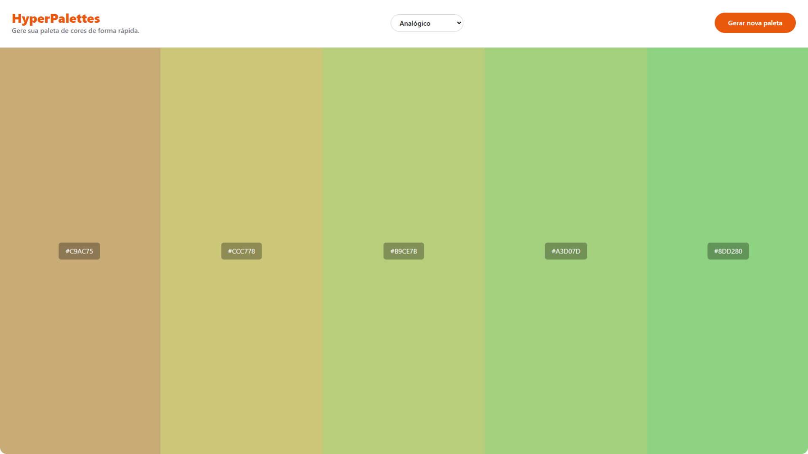

# HyperPalette

**HyperPalette** é uma ferramenta de geração de paletas de cores que utiliza a API **The Color API** para criar paletas de forma rápida e fácil. Os usuários podem escolher diferentes modos de geração de paletas, como **Monocromático**, **Analógico** e **Complementar**.

[](https://hyperpalettes.vercel.app/)

## Funcionalidades

- Geração de paletas de cores dinâmicas com integração à [The Color API](https://www.thecolorapi.com).
- Suporte a diferentes modos de cores, como:
  - **Monocromático**
  - **Analógico**
  - **Complementar**
- Interface simples e minimalista, focada na usabilidade.
- Exibição de códigos hexadecimais de cada cor gerada.
- Botão para gerar novas paletas rapidamente.

## Tecnologias Utilizadas

- **Angular 18**: Framework utilizado para construir a interface da aplicação.
- **Tailwind CSS**: Para estilização rápida e eficiente.
- **The Color API**: Para gerar paletas de cores dinamicamente.

## Como Usar

1. **Clone o repositório**:
   ```bash
   git clone https://github.com/seu-usuario/hyperpalette.git
   ```
2. **Instale as dependências**:
   ```bash
   cd hyperpalette
   npm install
   ```
3. **Inicie o servidor de desenvolvimento**:

   ```bash
   ng serve
   ```

4. Acesse a aplicação em `http://localhost:4200` no seu navegador.

## Estrutura do Projeto

- `src/app/app.component.ts`: Componente principal que gerencia a integração com a API, manipulação dos modos de cores e renderização das paletas.
- `src/app/color-scheme.interface.ts`: Definições de tipagem para os dados recebidos da API.
- `src/assets/styles.css`: Estilos gerais da aplicação com Tailwind CSS.

## Como Funciona

A aplicação envia requisições para **The Color API** e, com base na cor base e no modo selecionado, gera uma nova paleta de cores. Os usuários podem alternar entre modos de cores, como **monocromático**, **analógico** e **complementar**, para ver diferentes combinações de paletas. As cores são exibidas na tela com seu respectivo código hexadecimal, permitindo que os usuários as copiem facilmente.

## Exemplo de Uso

Abaixo está uma captura de tela da interface da aplicação:



## Melhorias Futuras

- Adicionar mais modos de geração de paletas (como triádico, quadricromático).
- Opção de salvar paletas geradas.
- Integração com outras APIs de cores para maior variedade de opções.

## Licença

Este projeto está licenciado sob a **MIT License**.
